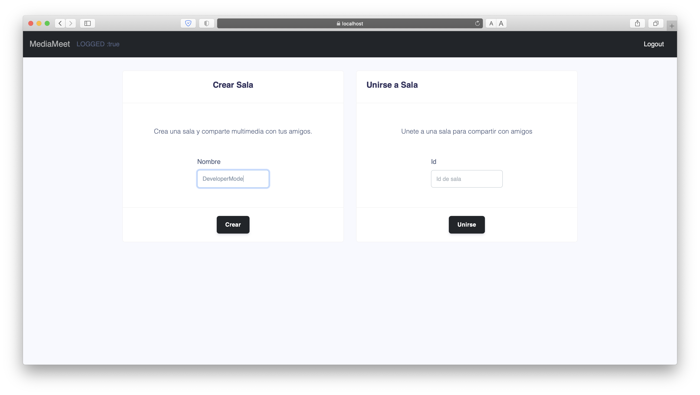

# MediaMeet User Manual

## Run the Application

There are two ways of using our app, currently is under development so can be run with the help of the development server thanks to Angular 10, but exists the posibility to access the app with a browser.

#### Via browser

Through the following link you can access the plataform

```text
https://media-meet.web.appthroug
```

#### Development server

Run `ng serve` for a dev server. Navigate to `http://localhost:4200/`. The app will automatically reload if you change any of the source files.

## Step by Step guide

1. Access to the platform


2. Once you are in the login page, you can either log in with Google, Facebook, GitHub or with an email and password 


3. Other feature offered in the plataform is to create a new user so register yourself so you can access as shown bellow


4. Once inside the application, you have the possibility to either create a new room so different users access it or join a existent room 




## Built With

* Angular 10
* Git - Version-control system
* MongoDB

## Versioning

We use GitFlow for versioning. For the versions available, see the [tags on this repository](https://github.com/Pac-Man-Bytes/MediaMeet-backend/releases/)

## Author

[**Santiago Rubiano Fierro**](https://github.com/srubianof) Software Engineering Student

[**Alejandro Bohorquez Alzate**](https://github.com/alejandrobohal) Software Engineering Student

[**Davor Cortez Cardozo**](https://github.com/d4v0r) Software Engineering Student

## License

This project is licensed under the MIT License - see the LICENSE.md file for details.

